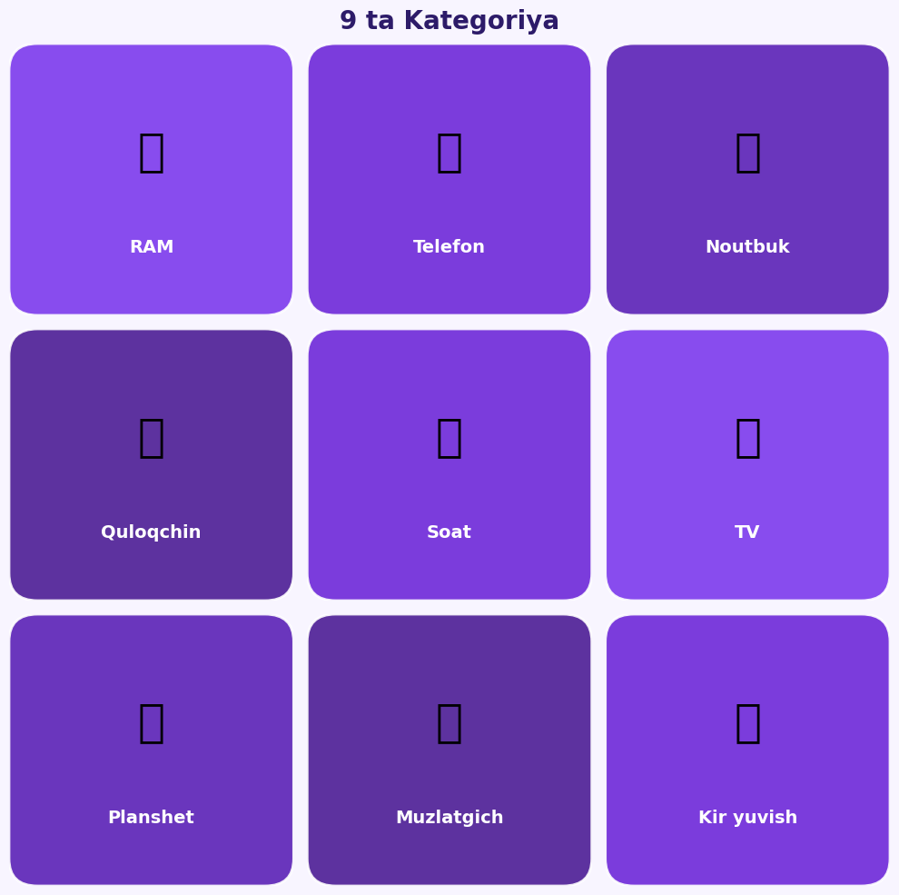
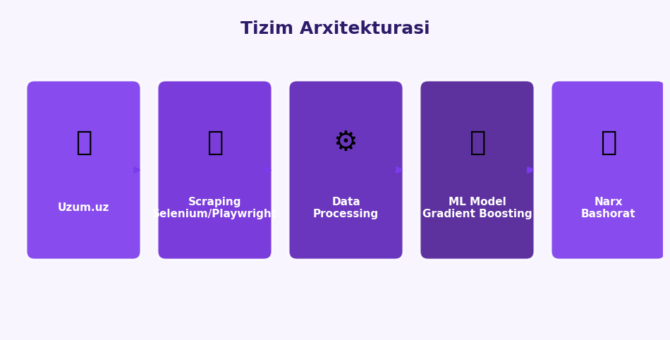
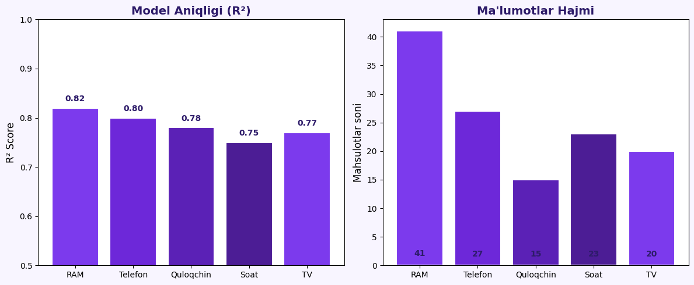
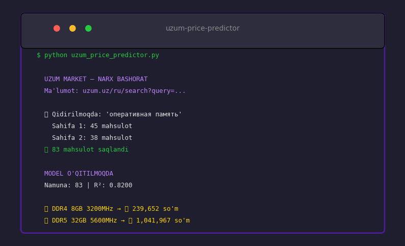

# 🛒 Uzum Market — Narx Bashorat Tizimi

> **Uzum.uz** marketplace'dan jonli ma'lumot olib, sun'iy intellekt yordamida mahsulot narxlarini bashorat qiluvchi tizim.


---

## 📋 Mundarija

- [Xususiyatlari](#-xususiyatlari)
- [Kategoriyalar](#-kategoriyalar)
- [O'rnatish](#-o'rnatish)
- [Ishga tushirish](#-ishga-tushirish)
- [Tizim Arxitekturasi](#-tizim-arxitekturasi)
- [Natijalar](#-natijalar)
- [Foydalanish](#-foydalanish)
- [Litsenziya](#-litsenziya)

---

## ✨ Xususiyatlari

| Xususiyat | Tavsif |
|-----------|--------|
| 🌐 **Live Scraping** | Uzum.uz saytidan real vaqtda ma'lumot olish |
| 🔍 **3 ta usul** | Selenium, Playwright, API — avtomatik tanlanadi |
| 🤖 **ML Model** | Gradient Boosting regressor — yuqori aniqlik |
| 📊 **9 ta kategoriya** | RAM, telefon, noutbuk va boshqalar |
| 💾 **Model saqlash** | Har bir kategoriya uchun alohida model |
| 🔄 **Interaktiv** | Nom yoki URL kiritib bashorat qilish |

---

## 📂 Kategoriyalar



| # | Kategoriya | Qidiruv so'zi | Patternlar |
|---|-----------|---------------|------------|
| 1 | 💾 **Operativ pamyat (RAM)** | оперативная память | DDR3/4/5, 4-64GB, chastota |
| 2 | 📱 **Telefonlar** | смартфон | Samsung, iPhone, Xiaomi, 5G |
| 3 | 💻 **Noutbuklar** | ноутбук | MacBook, Lenovo, HP, Gaming |
| 4 | 🎧 **Quloqchinlar** | наушники | AirPods, JBL, Sony, ANC |
| 5 | ⌚ **Soatlar** | умные часы | Apple Watch, Samsung, GPS |
| 6 | 📺 **Televizorlar** | телевизор | Samsung, LG, 4K, OLED |
| 7 | 📟 **Planshetlar** | планшет | iPad, Samsung, WiFi/LTE |
| 8 | 🧊 **Muzlatgichlar** | холодильник | Samsung, LG, No Frost |
| 9 | 👕 **Kir yuvish** | стиральная машина | Samsung, LG, Inverter |

---

## 🚀 O'rnatish

### Talablar

- Python 3.8+
- Chrome browser (Selenium uchun) **yoki** Chromium (Playwright uchun)

### 1. Repozitoriyani yuklab olish

```bash
git clone https://github.com/SardorCyberSafe/uzum-price-predictor.git
cd uzum-price-predictor
```

### 2. Kutubxonalarni o'rnatish

```bash
pip install -r requirements.txt
```

### 3. Browser driver o'rnatish

**Selenium (tavsiya etiladi):**
```bash
# ChromeDriver avtomatik yuklanadi
pip install selenium
```

**Playwright (alternativ):**
```bash
pip install playwright
playwright install chromium
```

---

## 💻 Ishga tushirish

```bash
python uzum_price_predictor.py
```

### Ish jarayoni:

1. **Kategoriyani tanlang** — raqam yoki nom bilan
2. **Scraping usulini tanlang** — selenium, playwright, api, yoki auto
3. **Ma'lumot yig'iladi** — Uzum.uz saytidan jonli
4. **Model o'qitiladi** — Gradient Boosting
5. **Bashorat qiling** — interaktiv rejimda

---

## 🏗️ Tizim Arxitekturasi



```
┌──────────┐     ┌──────────────┐     ┌──────────┐     ┌──────────┐     ┌──────────┐
│ Uzum.uz  │ ──► │  Scraping    │ ──► │  Data    │ ──► │   ML     │ ──► │  Narx    │
│ Website  │     │ Selenium/    │     │Processing│     │  Model   │     │ Bashorat │
│          │     │ Playwright   │     │          │     │ GBoost   │     │          │
└──────────┘     └──────────────┘     └──────────┘     └──────────┘     └──────────┘
```

---

## 📈 Natijalar



| Kategoriya | R² Score | MAE (so'm) | Namuna |
|-----------|----------|------------|--------|
| RAM | 0.82 | ~82,000 | 41 |
| Telefon | 0.80 | ~1,640,000 | 27 |
| Quloqchin | 0.78 | ~200,000 | 15 |
| Soat | 0.75 | ~500,000 | 23 |
| TV | 0.77 | ~800,000 | 20 |

> **Eslatma:** Natijalar ma'lumotlar hajmiga qarab o'zgaradi. Ko'proq ma'lumot = yuqori aniqlik.

---

## 🎮 Foydalanish

### Demo natija:



### Misol bashoratlar:

| Mahsulot | Bashorat narx |
|----------|---------------|
| DDR4 8GB 3200MHz | 239,652 so'm |
| iPhone 15 Pro 256GB | 13,500,000 so'm |
| Samsung Galaxy Watch6 | 2,500,000 so'm |
| AirPods Pro 2 | 2,200,000 so'm |

### URL orqali bashorat:

```
📝 > https://uzum.uz/ru/product/operativnaya-pamyat-kingston-1572552?skuId=5185182
📦 Оперативная память Kingston DDR4 8GB 3200MHz
💰 245,000 so'm
```

---

## 📁 Loyiha tuzilishi

```
uzum-price-predictor/
├── uzum_price_predictor.py   # Asosiy kod
├── requirements.txt          # Kutubxonalar
├── LICENSE                   # MIT License
├── .gitignore               # Git ignore
├── README.md                # Hujjat
└── images/                  # Rasmlar
    ├── banner.png
    ├── categories.png
    ├── architecture.png
    ├── demo.png
    └── performance.png
```

---

## ⚙️ Scraping usullari

| Usul | Tezlik | Ishonchlilik | Talab |
|------|--------|--------------|-------|
| **Selenium** | ⭐⭐⭐ | ⭐⭐⭐⭐⭐ | Chrome |
| **Playwright** | ⭐⭐⭐⭐ | ⭐⭐⭐⭐⭐ | Chromium |
| **API** | ⭐⭐⭐⭐⭐ | ⭐⭐ | Internet |
| **Auto** | ⭐⭐⭐ | ⭐⭐⭐⭐⭐ | Hammasi |

---

## 🤝 Hissa qo'shish

1. Fork qiling
2. Feature branch yarating (`git checkout -b feature/amazing-feature`)
3. Commit qiling (`git commit -m 'Add amazing feature'`)
4. Push qiling (`git push origin feature/amazing-feature`)
5. Pull Request oching

---

## 📝 Litsenziya

Bu loyiha [MIT License](LICENSE) ostida tarqatilgan.

---

## 👨‍💻 Muallif

**SardorCyberSafe**

- GitHub: [@SardorCyberSafe](https://github.com/SardorCyberSafe)

---

> ⚠️ **Eslatma:** Bu loyiha ta'lim maqsadida yaratilgan. Uzum.uz saytidan ma'lumot olishda ularning foydalanish shartlariga rioya qiling.
